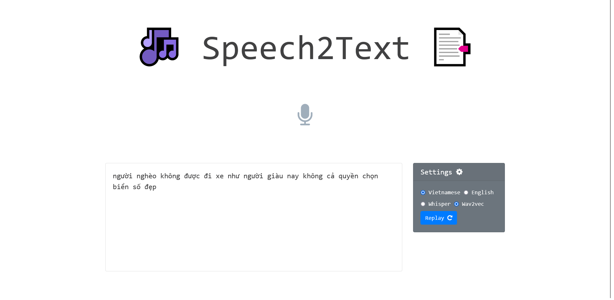

# Whiper vietnamese finetuning

\[In case you are looking for a Vietnamese ASR model, have a look at [HKAB/whisper-finetune-1-notebook](https://github.com/HKAB/whisper-finetune-1-notebook) \]

This notebook contains:
- Notebooks finetuning, inferencing and generating N-gram.
- Demo Whisper and Wav2vec


## Installation

For using Beam search with LM, install Whisper from my Github
```bash
    pip install git+https://github.com/HKAB/whisper.git
```

## Run

For training & inference

  ```shell
    python finetune.py  --model_name base \
                        --dataset vin100h

    python test.py      --checkpoint_path path/to/ckpt \
                        --dataset vin100h \
                        --model_name base

  ```

For generating language model with KenLM, use notebook in notebooks folder.

We share the [checkpoint](https://drive.google.com/file/d/1vSaQjvjljToYlekm_GvlOkJYGLQA5EdJ/view?usp=sharing) (*base, batch_size 1, gradient accumulation steps 10, epoch 14, lr 0.0001*)\.
## Demo



## Contributing

- We finetune Whisper on 100h speech dataset.
- We implement BeamSearchWithLM, using KenLM and showed positive result.

## Result

| Methods                   | Fleurs  | Vin100h (Full) | 
|---------------------------|---------|--------------- |
| Whisper (base)            | 50.38%  | 50.33%         |
| Finetune Whisper (base)   | 28.68%  | 33%            |
| Whisper (large) one shot  | -       | 26.87%         |
